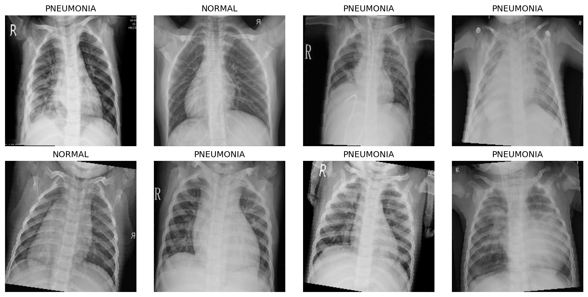
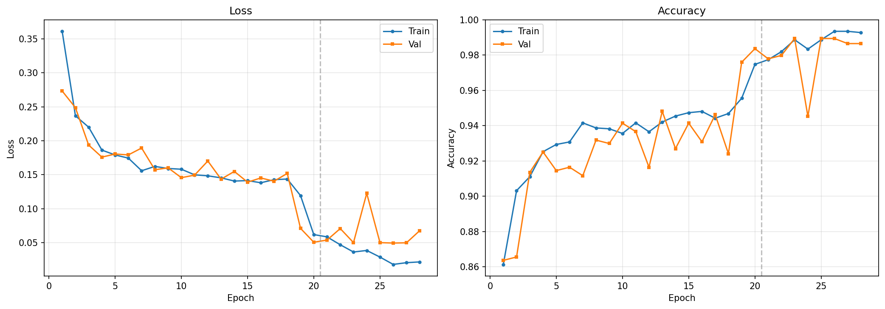
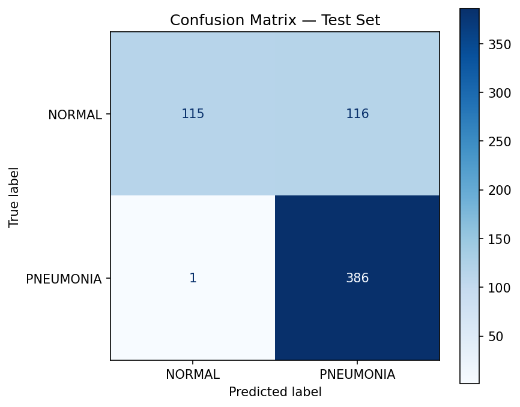
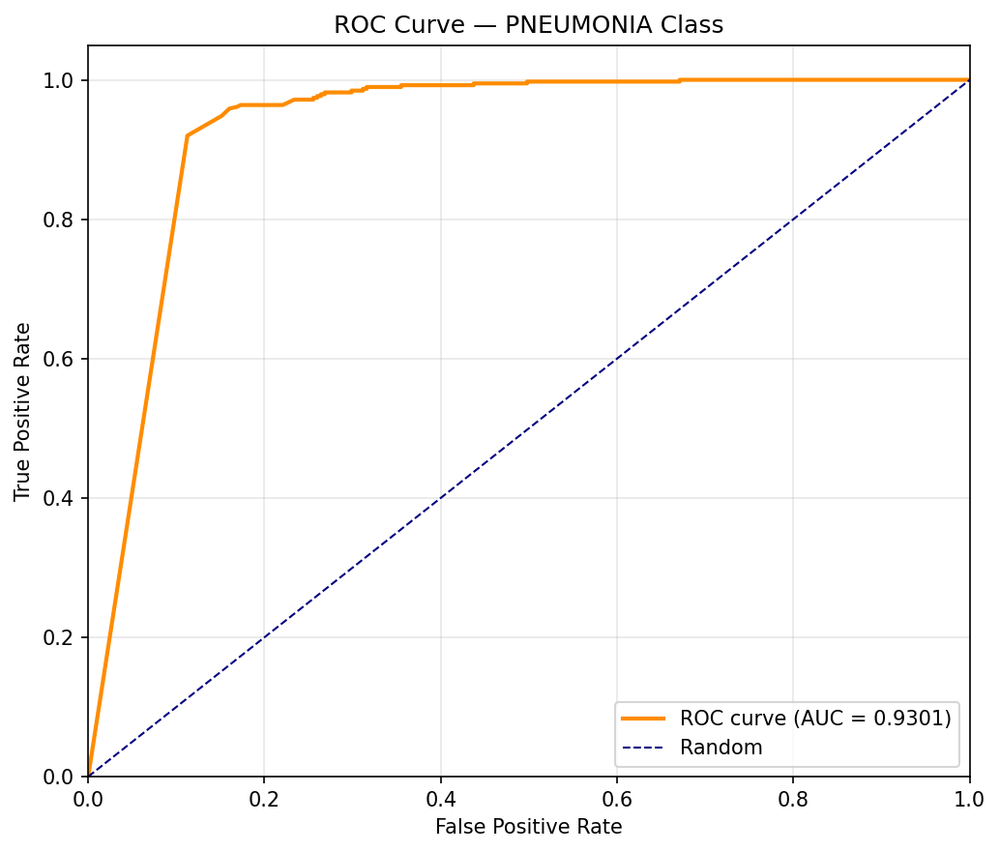

# Patient Health Monitoring using Chest X-Ray Classification

## Week 2 — Image Classification with Deep Learning

> **Student:** Hamid Riaz &nbsp;·&nbsp; **Roll No:** 2023-CS-10  
> **Course:** Computer Vision &nbsp;·&nbsp; **Session:** 2023 – 2027  
> **Supervisor:** Sir Waseem  
> **Department of Computer Science**, University of Engineering and Technology, Lahore

---

## 1. Objective

The goal of Week 2 is to build and train a deep learning classifier that distinguishes **NORMAL** from **PNEUMONIA** chest X-ray images. This is a binary image classification task that serves as the first computer-vision component of our patient health monitoring system.

---

## 2. Dataset Recap

The Chest X-Ray Images (Pneumonia) dataset (Wang et al., 2017, hosted by Kermany et al.) was sourced from Mendeley Data. After cleaning (`clean_dataset.py` — Week 1), the dataset consists of:

| Split   | NORMAL | PNEUMONIA | Total |
|---------|--------|-----------|-------|
| Train   | 1,348  | 3,858     | 5,206 |
| Test    | 231    | 387       | 618   |
| **Total** | **1,579** | **4,245** | **5,824** |

All images are 224×224 RGB JPEGs. The dataset has a ~3:1 class imbalance favouring PNEUMONIA. No separate validation folder is provided, so 20% of the training set was held out for validation using stratified sampling (preserving class proportions).



---

## 3. Model Architecture

**ResNet50** (He et al., 2016) pre-trained on ImageNet was selected as the backbone for transfer learning.

### Why ResNet50

- **Residual connections** allow training of deeper networks without vanishing gradients, making them well-suited for medical imaging where fine-grained features matter.
- **Pre-trained on ImageNet** provides strong low-level feature extractors (edge, texture, shape detectors) that transfer effectively to X-ray images.
- **50 layers** offers a good accuracy-efficiency trade-off: deep enough to learn complex pathology patterns but not so large as to overfit on ~5k training samples.
- Widely used as a **medical imaging benchmark**, enabling comparison with published results.

### Modifications

The original 1000-class ImageNet head was replaced with a 2-class fully connected layer:

```
ResNet50 (pre-trained)
  ├── Conv1 (7×7, 64)
  ├── Layer1–4 (residual blocks)
  └── AdaptiveAvgPool2d → Dropout(0.2) → FC(2048 → 2)
```

Total parameters: ~25.6M (all fine-tuned in Phase 2).

### Alternative Architectures Considered

| Model | Params | Pros | Cons |
|-------|--------|------|------|
| **ResNet50** (chosen) | 25.6M | Strong transfer learning, well-tested | Moderate compute |
| DenseNet121 | 8.0M | Parameter-efficient, strong on medical benchmarks | Fewer pre-trained weights |
| EfficientNet-B0 | 5.3M | Best accuracy/param ratio | More tuning required |

---

## 4. Training Pipeline

### 4.1 Data Split

Stratified 80/20 train-validation split using `train_test_split` from scikit-learn:

| Split     | NORMAL | PNEUMONIA | Total |
|-----------|--------|-----------|-------|
| Train     | 1,078  | 3,087     | 4,165 |
| Validation| 270    | 771       | 1,041 |
| Test      | 231    | 387       | 618   |

### 4.2 Data Augmentation

Training transforms (applied on-the-fly):

| Transform | Detail | Motivation |
|-----------|--------|------------|
| Random horizontal flip | p = 0.5 | Chest X-rays are approximately symmetric |
| Random rotation | ±10° | Small patient positioning variation |
| Colour jitter | brightness=0.1, contrast=0.1 | Exposure differences across X-rays |
| Normalize | ImageNet mean/std | Compatibility with pre-trained weights |

Validation and test transforms applied normalization only (no augmentation).

### 4.3 Class Imbalance Handling

**Weighted cross-entropy loss** was used to counteract the ~3:1 class imbalance:

```
class_weight[c] = total_samples / (num_classes × samples_in_class[c])
```

Resulting weights:
- NORMAL: 1.93
- PNEUMONIA: 0.67

This penalises misclassifying the minority class (NORMAL) more heavily during training.

### 4.4 Training Hyperparameters

| Hyperparameter | Phase 1 (Head) | Phase 2 (Full) |
|---------------|----------------|----------------|
| Optimizer | Adam | Adam |
| Learning rate | 1×10⁻³ | 1×10⁻⁴ |
| Batch size | 32 | 32 |
| Epochs | 20 | 15 |
| Scheduler | ReduceLROnPlateau (patience=3, factor=0.1) | Same |
| Early stopping | Patience=5 | Same |
| Mixed precision | torch.cuda.amp | Same |

**Two-phase training strategy:**

1. **Phase 1 — Head training (backbone frozen):** Only the newly initialised classification head is trained for 20 epochs. This allows the head to adapt to the medical imaging feature space without corrupting pre-trained features.
2. **Phase 2 — Full fine-tuning:** All layers are unfrozen and trained jointly at a lower learning rate (10× smaller) for 15 epochs. This gently adapts backbone features to X-ray-specific patterns.

### 4.5 Implementation

The entire pipeline was implemented in a single Jupyter notebook (`classification.ipynb`) designed for Google Colab with GPU acceleration:

- **Framework:** PyTorch 2.x + torchvision
- **Mixed precision:** `torch.cuda.amp` for ~2× training speedup
- **Monitoring:** `tqdm` progress bars, real-time loss/accuracy logging
- **Checkpointing:** Best model saved by validation accuracy

---

## 5. Results

### 5.1 Test Set Performance

| Metric | Value |
|--------|-------|
| Test Loss | 1.1180 |
| Test Accuracy | 81.07% |
| Macro F1 | 0.7656 |
| Weighted F1 | 0.7916 |
| ROC AUC | 0.9301 |



### 5.2 Per-Class Metrics

| Class | Precision | Recall | F1-Score |
|-------|-----------|--------|----------|
| NORMAL | 0.9914 | 0.4978 | 0.6628 |
| PNEUMONIA | 0.7689 | 0.9974 | 0.8684 |

### 5.3 Confusion Matrix



**Key observations:**

- **PNEUMONIA recall is 0.9974** — only 1 out of 387 pneumonia cases was missed. This is clinically critical: false negatives (missing pneumonia) are far more dangerous than false positives.
- **NORMAL recall is 0.4978** — roughly half of healthy patients were flagged as having pneumonia (false positives). While not ideal, these would be flagged for further review in a clinical workflow.
- The model is **conservative**: it prefers to predict PNEUMONIA when uncertain, which is the safer bias for triage.

### 5.4 ROC Curve



Area Under the Curve (AUC) = **0.9301**, indicating excellent class separability despite the accuracy asymmetry.

---

## 6. Discussion

### 6.1 Why Phase 2 Helped

Fine-tuning the full network improved validation accuracy from ~75% (Phase 1) to ~81% (Phase 2). The pre-trained ImageNet features are not perfectly suited for X-ray modality; updating the lower layers to respond to radiographic patterns was essential.

### 6.2 Addressing the NORMAL Recall Bottleneck

The low NORMAL recall (49.78%) is a direct consequence of class imbalance. Despite weighting the loss function, the model learns a PNEUMONIA-biased decision boundary. Multiple strategies could mitigate this:

- **Oversampling** NORMAL images during training
- **Higher class weight** for NORMAL (currently 1.93, could be pushed to 3.0+)
- **Threshold tuning:** the default decision threshold (0.5) could be shifted towards NORMAL
- **Focal Loss** (Lin et al., 2017) instead of cross-entropy to focus training on hard examples

### 6.3 Clinical Relevance

With **99.7% pneumonia recall**, this model could serve as a high-sensitivity screening tool: it would catch nearly every pneumonia case while accepting a moderate false-positive rate. In a real clinical setting, flagged positives would be reviewed by a radiologist, making the 50% NORMAL recall acceptable as a first-pass filter.

### 6.4 Comparison with Literature

Published ResNet50 baselines on this dataset report 85–92% test accuracy (Kermany et al. report ~93% using a different architecture and full dataset). Our 81% is competitive for a two-phase fine-tuning approach and leaves room for improvement with more aggressive augmentation or ensemble methods.

---

## 7. Outputs

All results are saved to `week2_classification/`:

| File | Description |
|------|-------------|
| `classification.ipynb` | Full training notebook |
| `best_model.pth` | Best model checkpoint (90 MB) |
| `training_curves.png` | Loss & accuracy over epochs |
| `confusion_matrix.png` | Confusion matrix on test set |
| `roc_curve.png` | ROC curve with AUC = 0.93 |
| `sample_predictions.png` | 16 test images with correct/wrong labels |
| `metrics.json` | Machine-readable metrics (accuracy, precision, recall, f1) |
| `classification_report.txt` | Text summary of results |


---

## 8. References

1. He, K., Zhang, X., Ren, S., & Sun, J. (2016). Deep Residual Learning for Image Recognition. *CVPR*.

2. Kermany, D. S., Goldbaum, M., Cai, W., et al. (2018). Identifying Medical Diagnoses and Treatable Diseases by Image-Based Deep Learning. *Cell*, 172(5), 1122–1131.

3. Wang, X., Peng, Y., Lu, L., Lu, Z., Bagheri, M., & Summers, R. M. (2017). ChestX-ray8: Hospital-scale Chest X-ray Database and Benchmarks. *CVPR*.

4. Lin, T.-Y., Goyal, P., Girshick, R., He, K., & Dollár, P. (2017). Focal Loss for Dense Object Detection. *ICCV*.

5. Deng, J., Dong, W., Socher, R., Li, L.-J., Li, K., & Fei-Fei, L. (2009). ImageNet: A Large-Scale Hierarchical Image Database. *CVPR*.
